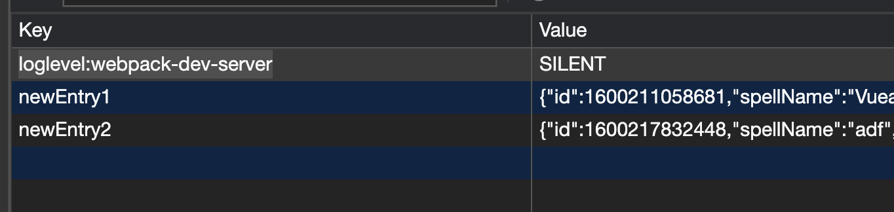

# The Standard Book of Spells (Electronic Version)
### Developers
* [Corbin March](https://github.com/MarchCorbin)
* [Linus Leas ](https://github.com/Leasw144)

### Project Links
* [Repo](https://github.com/MarchCorbin/spellbook)
* [Project Board](https://github.com/MarchCorbin/spellbook/projects/1)
* [Project Spec](https://frontend.turing.io/projects/module-3/stretch.html)

## Abstract
This app seeks to create an app that retrieves a number of Spells that exist in the Harry Potter universe and allows users to organize them by type, as well as allowing users to create their own spells which can be stored in local storage and viewed together with the original list.

## Set Up

1. Clone down this repo. You can use an optional argument when you run git clone (you can replace the [...] with the terminal command arguments): git clone [remote-address] [...what you want to name the repo]
2. Now try to commit something and push it up to your new repo. If everything is setup correctly, you should see the changes on GitHub.
3. Once you have cloned the repo, change into the directory and install the project dependencies by running `npm install`.
4. To verify that it is setup correctly, `npm run serve` in your terminal. Go to http://localhost:8080/ (or wherever the server tells you it's running) on the browser to interact with the application. Enter control + c in your terminal to stop the server at any time.

### Technologies/Systems
* Vue
* Github Project Manager
* Node Fetch
* Webpack
* Local Storage
* Vue Test Utils
* Jest

## Reflections
Overall, we found Vue to be very efficient when it came to building the app - being able to have the css, html, and javascript occur in one file per component made things easy to navigate and build. That being said, we did get caught up in a few odd scenarios or quirks that Vue required where it begged the question of, "Why would we know that?" Testing was also confusing as we had two Vue developers tell us that things like integration tests weren't generally used and that syntax and common practices often came down to opinions. 

Another thing to note and what may have contributed to some of the bugs we encountered is that Vue 3.0.0 (which includes router capabilities used in this project) was released this year so documentation, especially in regards to testing, was scant or otherwise in progress which was not known at the time we recieved the project.

Overall, it was a learning experience and we did gain exposure to Vue which was the intent. Given more time, we would have liked to have added functionality to delete and favorite spells and provide a new route where these can be seen. Clarification on testing practices also would have been nice. We spent more time with the bugs we encountered with Webpack and local storage than we would have liked (explained below) but are overall satisfied with the app given the unique difficulties we had encountered with a technology we had not touched before now.

### Known Bugs

* As mentioned earlier, we spent an unexpected amount of time dealing with local storage issues in which webpack was injecting an object of `loglevel:webpack-dev-server` into our array which caused rendering issues. This was eventually handled using conditional logic as a quick fix but the problem may come from the several versioning issues we had encountered as well.

 
* Versioning and lack of easy-to-read documentation (or even documentation that reflected our issues) was lacking, so testing at the moment only tests for images and text as they should appear. We would have liked to have added an integration test but were told this was somewhat uncommon with Vue but perhaps other developers might have other opinions.
 
* The reader may have noticed that there are two `assets` folder on this repo. Originally, our dynamically rendered cards were not rendering as they should have. With the help of a Vue Developer, we were told that `assets` needed to go in the public folder as opposed to `src` which was never explicitly stated anywhere. Having that issue solved, we then encountered a bug where our static images could not be found and would crash the app. 
 Doing some trial and error, we found that our static images would only appear if assets were in `src` but not in `public` of which the dynically rendered cards had the opposite problem. The current workaround was to simply include both assets folder in their respective location but an explanation for this bug(?) would be appreciated

## Gif Showcase

* Users can view all spells that appear in the Potterverse
 

* Users can create their own spells 
 

 

* Users can filter and view spells by their type
 

### Customize configuration
See [Configuration Reference](https://cli.vuejs.org/config/).
